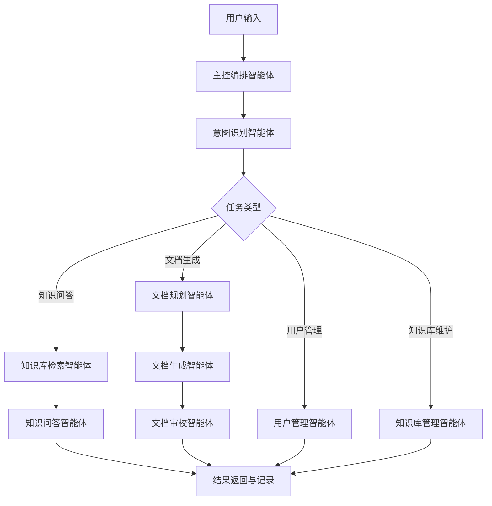

# ThriveX 文档生成智能体规划

## 目标

文档生成智能体用于把用户的自然语言输入转化为可追踪、可审校、可导出的技术文档或知识问答结果。它必须基于 ThriveX 工作区已有资料生成内容，优先引用知识库、数据库结构、接口文档和项目源码，不允许脱离项目背景自由编造。

本规划作为后续开发边界。实现时应优先落在 `ThriveX-Server`，由后端统一完成意图识别、知识库检索、模型调用、文档生成和权限控制；`ThriveX-Admin` 提供管理和使用界面；`ThriveX-Blog` 后续只在需要公开问答入口时接入。

## 总体链路



## Agent 清单

| Agent | 核心职责 | 所属层 | MVP 是否必须 |
| --- | --- | --- | --- |
| 主控编排智能体 | 接收输入、拆任务、调度工具、汇总结果 | Server | 是 |
| 意图识别智能体 | 判断用户意图和任务类型 | Server | 是 |
| 知识库管理智能体 | 导入、解析、分块、维护知识资料 | Server/Admin | 是 |
| 知识库检索智能体 | 根据问题检索相关资料和引用来源 | Server | 是 |
| 知识问答智能体 | 基于检索资料回答问题 | Server/Admin | 是 |
| 文档规划智能体 | 选择文档类型、生成大纲和章节计划 | Server | 是 |
| 文档生成智能体 | 分章节生成结构化技术文档 | Server/Admin | 是 |
| 文档审校智能体 | 检查准确性、完整性、敏感信息和引用 | Server | 是 |
| 工具执行智能体 | 统一执行模型调用、检索、导出、读取 OpenAPI 等工具 | Server | 是 |
| 用户管理智能体 | 登录、注册策略、角色权限、访问控制 | Server/Admin | 是 |
| 记录与追踪智能体 | 保存会话、任务、工具日志、生成结果 | Server | 二期 |
| 导出发布智能体 | 导出 Markdown、HTML、DOCX，后续可发布文章 | Server/Admin | 二期 |

## 1. 主控编排智能体

### 职责

- 作为统一入口接收用户输入。
- 调用意图识别智能体，判断用户要做什么。
- 根据意图选择后续 Agent 和工具。
- 管理一次任务的状态：待执行、执行中、已完成、失败。
- 聚合最终输出，包括正文、引用来源、工具日志和错误信息。

### 输入

```json
{
  "message": "帮我生成 ThriveX 的部署文档",
  "sessionId": 1,
  "options": {
    "docType": "deployment",
    "outputFormat": "markdown"
  }
}
```

### 输出

```json
{
  "intent": "DOCUMENT_GENERATION",
  "status": "completed",
  "resultId": 12,
  "answer": "生成后的文档正文",
  "citations": []
}
```

### 工具权限

- 可调用意图识别、检索、问答、文档生成、审校、导出工具。
- 可读取任务上下文和用户信息。
- 不直接访问模型密钥，不直接读写业务源码。

### 禁止事项

- 不直接编造最终答案。
- 不绕过权限校验调用管理接口。
- 不把模型 API Key 返回给前端。

## 2. 意图识别智能体

### 职责

- 判断用户输入属于哪类任务。
- 抽取文档类型、目标项目、输出格式、约束条件。
- 给出置信度，置信度过低时让主控编排智能体追问用户。

### 意图枚举

| Intent | 说明 | 示例 |
| --- | --- | --- |
| `DOCUMENT_GENERATION` | 生成结构化技术文档 | 生成接口文档、部署文档、数据库说明 |
| `KNOWLEDGE_QA` | 回答知识库问题 | 后端 API 前缀在哪里配置 |
| `KNOWLEDGE_IMPORT` | 导入或更新知识资料 | 把这份 Markdown 加入知识库 |
| `USER_MANAGEMENT` | 用户登录、注册、权限相关 | 创建一个普通文档用户 |
| `DOCUMENT_REVIEW` | 审校已有文档 | 检查这份文档是否和项目一致 |
| `DOCUMENT_EXPORT` | 导出文档 | 导出成 DOCX |
| `UNKNOWN` | 无法判断 | 输入过短或意图不清 |

### 输出结构

```json
{
  "intent": "DOCUMENT_GENERATION",
  "confidence": 0.91,
  "docType": "api",
  "targetProjects": ["ThriveX-Server", "ThriveX-Admin"],
  "requiredTools": ["knowledge_search", "document_outline", "llm_generate", "document_review"]
}
```

### MVP 规则

- 第一版可以先用规则 + 模型分类混合实现。
- 明确关键词优先走规则，例如“生成、文档、说明、导出、问一下、为什么、注册、登录”。
- 规则无法判断时再调用默认助手模型。

## 3. 知识库管理智能体

### 职责

- 管理知识来源。
- 支持导入项目内文档、接口说明、数据库 SQL、用户上传资料。
- 对资料进行解析、清洗、分块、打标签。
- 维护知识库版本，支持启用、停用、重新索引。

### 知识来源

| 来源 | MVP 支持 | 说明 |
| --- | --- | --- |
| `AGENTS.md` | 是 | 工作区开发规范和项目边界 |
| `ThriveX-Blog/docs/*.md` | 是 | 项目、接口、测试文档 |
| 三项目 `README.md` | 是 | 项目说明 |
| `ThriveX-Server/ThriveX.sql` | 是 | 数据库结构主来源 |
| Knife4j/OpenAPI JSON | 是 | 接口契约 |
| Admin 上传 Markdown/TXT | 是 | 人工补充资料 |
| PDF/DOCX | 二期 | 需要文件解析能力 |
| 文章表 `article` | 二期 | 可将已发布技术文章纳入知识库 |

### 分块规则

- Markdown 按标题层级切分。
- SQL 按表结构、索引、初始化数据切分。
- OpenAPI 按接口分组和路径切分。
- 每个 chunk 保存标题、正文、来源路径、来源类型、更新时间、标签。

### 禁止事项

- 不导入 `.env`、`application-pro.yml` 中的敏感值。
- 不把本地数据库密码、模型密钥写入知识库。
- 不直接执行 `ThriveX.sql`。

## 4. 知识库检索智能体

### 职责

- 根据用户问题检索最相关的知识片段。
- 返回引用来源、命中分数、片段摘要。
- 为知识问答和文档生成提供上下文。

### 检索策略

MVP 阶段：

- 关键词检索。
- 标题权重高于正文。
- 项目名、接口路径、表名、文件路径作为强匹配。
- 每次最多返回 8 到 12 个 chunk。

二期增强：

- 向量检索。
- 混合检索：关键词 + 向量 + 重排序。
- 根据用户角色过滤知识来源。

### 输出结构

```json
{
  "query": "用户登录接口是什么",
  "chunks": [
    {
      "sourceId": 1,
      "chunkId": 18,
      "title": "Auth/User",
      "sourcePath": "ThriveX-Blog/docs/API.md",
      "score": 0.86,
      "content": "POST /api/user/login ..."
    }
  ]
}
```

## 5. 知识问答智能体

### 职责

- 基于知识库检索结果回答用户问题。
- 给出简洁、准确、可追溯的答案。
- 对不确定内容明确说明缺少资料。
- 支持连续追问，能够读取当前会话上下文。

### 回答规则

- 优先使用知识库资料。
- 答案必须包含来源引用。
- 如果知识库没有命中，不直接编造；可以建议用户导入资料或允许读取项目源码后再回答。
- 涉及接口、端口、表名、环境变量时必须精确。

### 示例输出

```json
{
  "answer": "用户登录接口是 POST /api/user/login，Admin 会通过 VITE_PROJECT_API 指向后端基础地址。",
  "citations": [
    {
      "sourcePath": "ThriveX-Blog/docs/API.md",
      "title": "Auth/User"
    }
  ]
}
```

## 6. 文档规划智能体

### 职责

- 根据用户需求选择文档模板。
- 生成大纲、章节目标、需要检索的知识点。
- 判断是否缺少必要资料。

### 文档类型

| Doc Type | 说明 | 主要知识来源 |
| --- | --- | --- |
| `project_overview` | 项目总体说明 | AGENTS、README、PROJECT.md |
| `architecture` | 架构设计文档 | AGENTS、三项目源码结构 |
| `deployment` | 启动部署文档 | AGENTS、README、env 配置 |
| `api` | 接口文档 | API.md、OpenAPI、Controller |
| `database` | 数据库说明 | ThriveX.sql、model 实体 |
| `feature_design` | 功能设计文档 | 需求输入、相关源码、接口 |
| `testing` | 测试验收文档 | TESTING.md、QA 记录 |
| `user_manual` | 用户操作手册 | Admin 页面、接口能力 |
| `agent_design` | 智能体设计文档 | 本规划、实现代码 |

### 输出结构

```json
{
  "docType": "deployment",
  "title": "ThriveX 本地启动与部署说明",
  "outline": [
    "项目组成",
    "环境要求",
    "数据库初始化",
    "Server 启动",
    "Blog 启动",
    "Admin 启动",
    "常见问题"
  ],
  "requiredQueries": [
    "ThriveX ports env variables",
    "Server database config",
    "Admin VITE_PROJECT_API"
  ]
}
```

## 7. 文档生成智能体

### 职责

- 基于文档规划和知识库上下文生成正文。
- 按章节生成，避免一次性大段生成导致遗漏。
- 生成 Markdown 作为基础格式。
- 保留引用来源，方便审校和追溯。

### 生成要求

- 结构清晰，有标题、步骤、表格、注意事项。
- 技术事实必须来自知识库或项目源码。
- 对未确认信息使用“待确认”标记。
- 不写入真实密钥、密码、Token。
- 输出适合直接放入项目文档。

### MVP 输出格式

```json
{
  "title": "ThriveX 接口说明文档",
  "format": "markdown",
  "content": "# ThriveX 接口说明文档\n\n...",
  "citations": [],
  "status": "draft"
}
```

## 8. 文档审校智能体

### 职责

- 检查生成文档是否符合 ThriveX 项目事实。
- 检查是否遗漏关键模块。
- 检查是否包含敏感信息。
- 检查是否存在无来源断言。
- 输出修改建议和质量评分。

### 审校维度

| 维度 | 说明 |
| --- | --- |
| 准确性 | 端口、接口、表名、路径、技术栈是否正确 |
| 完整性 | 是否覆盖用户要求的范围 |
| 可执行性 | 启动、部署、测试步骤是否能照做 |
| 一致性 | 是否符合 AGENTS.md 和项目约束 |
| 安全性 | 是否泄露敏感配置 |
| 可读性 | 章节、表格、描述是否清楚 |

### 输出结构

```json
{
  "score": 86,
  "passed": true,
  "issues": [
    {
      "level": "warning",
      "message": "文档提到向量检索，但当前 MVP 尚未实现，应标记为二期能力。"
    }
  ]
}
```

## 9. 工具执行智能体

### 职责

- 统一封装所有可被 Agent 调用的工具。
- 为主控编排智能体提供安全、可记录、可限权的工具调用能力。
- 保存工具调用日志，便于排错和审计。

### MVP 工具

| Tool | 能力 |
| --- | --- |
| `assistant_model_call` | 通过 Server 调用默认大模型 |
| `knowledge_search` | 检索知识库 chunk |
| `knowledge_import` | 导入项目文档或用户上传资料 |
| `openapi_fetch` | 获取 `http://localhost:9003/v2/api-docs` |
| `sql_schema_parse` | 解析 `ThriveX.sql` 表结构 |
| `document_save` | 保存生成结果 |
| `document_export_markdown` | 导出 Markdown |

### 后续工具

- `document_export_docx`
- `document_export_html`
- `source_code_index`
- `article_publish`
- `qa_browser_snapshot`

### 安全规则

- 工具必须有白名单。
- 工具调用必须记录用户、任务、参数摘要、执行状态。
- 模型密钥只在 Server 端读取。
- 不允许前端直接调用第三方模型 API。

## 10. 用户管理智能体

### 职责

- 处理用户登录、注册策略、角色权限。
- 判断用户是否能使用文档生成、知识库导入、模型配置等能力。
- 维护智能体会话与用户身份的关联。

### 当前基础

当前项目已有：

- `POST /api/user/login`
- `GET /api/user/check`
- 后台用户 CRUD
- JWT 拦截器
- `user_token` 登录态记录

### 需要补齐

| 能力 | 建议 |
| --- | --- |
| 注册 | 默认不开放公网注册；如必须开放，新增 `POST /api/user/register`，加 `@NoTokenRequired` 和 `@RateLimit` |
| 角色 | 至少区分 `admin`、`editor`、`viewer` |
| 权限 | 模型配置、知识库导入、文档生成、文档审校、导出分别授权 |
| 审计 | 记录谁生成了什么文档、调用了哪些工具 |

### MVP 权限建议

| 角色 | 能力 |
| --- | --- |
| `admin` | 全部能力，包括模型配置和知识库管理 |
| `editor` | 知识问答、文档生成、文档导出 |
| `viewer` | 只允许知识问答和查看自己记录 |

## 11. 记录与追踪智能体

### 职责

- 保存会话消息。
- 保存文档生成任务。
- 保存工具调用日志。
- 保存模型调用消耗和错误信息。

### 二期目标

- 支持重新生成某一章节。
- 支持回滚到历史版本。
- 支持对比两次生成结果。
- 支持按用户、文档类型、任务状态筛选。

## 12. 导出发布智能体

### 职责

- 将生成结果导出为不同格式。
- 第一阶段支持 Markdown 下载。
- 二期支持 DOCX、HTML。
- 后续可选择发布为博客文章草稿。

### 发布边界

- 默认只保存为文档草稿。
- 发布到文章必须由用户确认。
- 不自动覆盖现有文章。

## 数据库规划

### 新增表建议

| 表名 | 用途 | MVP |
| --- | --- | --- |
| `knowledge_source` | 知识来源元信息 | 是 |
| `knowledge_chunk` | 知识分块内容 | 是 |
| `agent_session` | 智能体会话 | 是 |
| `agent_message` | 会话消息 | 是 |
| `document_task` | 文档生成任务 | 是 |
| `document_result` | 文档生成结果 | 是 |
| `agent_tool_log` | 工具调用日志 | 二期 |
| `user_role` | 用户角色 | 二期 |
| `user_permission` | 权限点 | 二期 |

### `assistant` 表扩展建议

当前 `assistant` 表可继续作为模型配置表，后续建议扩展：

| 字段 | 说明 |
| --- | --- |
| `provider` | 模型供应商，例如 DeepSeek、OpenAI、Moonshot |
| `api_base_url` | API 基础地址，替代含义不清的 `url` |
| `temperature` | 默认温度 |
| `max_tokens` | 默认最大输出 |
| `enabled` | 是否启用 |
| `usage_type` | 用途，例如 chat、doc、review |

扩展时必须同步 `ThriveX.sql`、`Assistant` 实体、Admin 类型和页面表单。

## 后端接口规划

Controller 不手写 `/api` 前缀，仍由 `WebConfig` 统一加前缀。

| 接口 | 方法 | 说明 |
| --- | --- | --- |
| `/agent/chat` | `POST` | 统一问答入口 |
| `/agent/document/generate` | `POST` | 生成文档 |
| `/agent/document/review` | `POST` | 审校文档 |
| `/agent/document/{id}` | `GET` | 获取生成结果 |
| `/agent/document/{id}/export` | `GET` | 导出文档 |
| `/agent/session/list` | `POST` | 会话列表 |
| `/knowledge/source` | `POST` | 新增知识来源 |
| `/knowledge/source/list` | `POST` | 知识来源列表 |
| `/knowledge/source/{id}/index` | `POST` | 重建索引 |
| `/knowledge/search` | `POST` | 知识库检索 |
| `/user/register` | `POST` | 可选注册接口 |

## Admin 页面规划

| 页面 | 路由建议 | 能力 |
| --- | --- | --- |
| 文档智能体 | `/agent` | 输入问题、选择模式、查看回答或文档 |
| 知识问答 | `/agent/qa` | 聊天式问答、展示引用来源 |
| 文档生成 | `/agent/document` | 选择文档类型、生成、预览、保存、导出 |
| 知识库管理 | `/knowledge` | 导入资料、查看分块、重建索引 |
| 生成记录 | `/agent/history` | 查看历史会话和文档 |
| 助手管理 | `/assistant` | 保留并增强模型配置 |
| 用户管理 | 可复用现有用户页 | 用户、角色、权限 |

## MVP 开发顺序

1. Server 增加模型调用服务，前端不再直连模型 API。
2. 新增知识库表：`knowledge_source`、`knowledge_chunk`。
3. 实现知识库导入：先支持 `AGENTS.md`、`docs/*.md`、`ThriveX.sql`。
4. 实现关键词检索接口。
5. 实现意图识别和统一 `/agent/chat`。
6. 实现文档规划和 Markdown 生成。
7. 实现文档审校。
8. Admin 新增文档智能体页面。
9. Admin 新增知识库管理页面。
10. 浏览器 QA：登录、问答、生成、保存、导出、响应式检查。

## 验收标准

### 功能验收

- 登录后可以进入文档智能体页面。
- 可以导入项目资料到知识库。
- 可以针对项目问题进行问答，答案包含来源。
- 可以输入需求生成结构化 Markdown 文档。
- 文档生成后可以保存和重新查看。
- 模型调用必须经过 Server，浏览器不暴露 API Key。

### 质量验收

- 生成内容与知识库资料一致。
- 找不到资料时不会编造确定结论。
- 敏感配置不会进入知识库或生成结果。
- 文档审校能发现明显不一致和无来源断言。
- Admin 端 375、768、1440 宽度可用。

### 工程验收

- SQL、实体、DTO/VO、Mapper、Service、Controller、Admin API、Admin 类型同步。
- 新 Controller 不手写 `/api` 前缀。
- 公开接口必须明确 `@NoTokenRequired`，需要防刷的公开接口加 `@RateLimit`。
- `npm run lint`、`npm run build`、`mvn -pl blog -am package` 至少完成可验证项。

## 后续注意事项

- 当前项目已有 `assistant` 管理页面，但它只适合作为模型配置，不等于完整智能体。
- 当前用户登录已存在；注册是否开放需要产品上先确认，默认建议只允许管理员创建用户。
- 知识库第一版优先做“可追溯的关键词检索”，向量检索放到二期。
- 文档导出第一版优先 Markdown，DOCX 可以复用后端已有 Apache POI 基础能力在二期实现。
- 所有智能体能力都应以 Server 端服务为准，Admin 只是使用界面。
